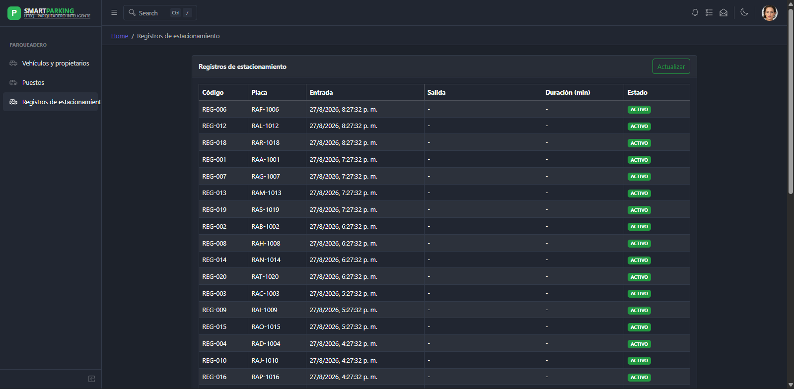
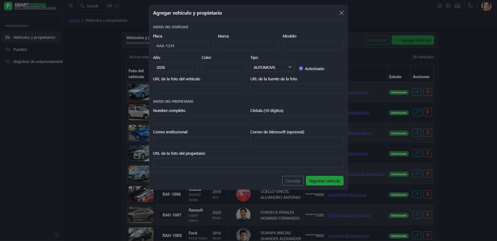
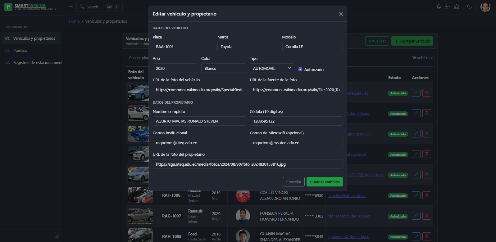
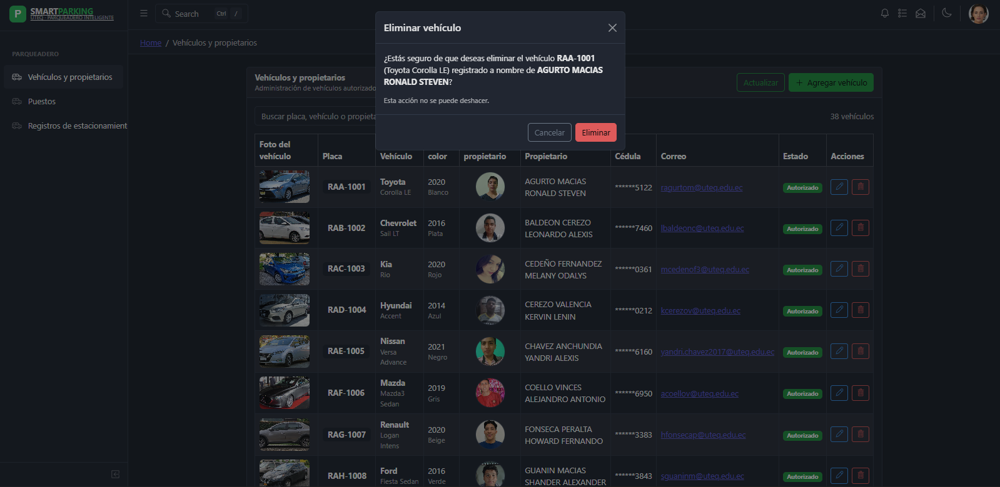

# Smart Parking UTEQ — CRUD de Vehículos, Puestos y Registros

Consola administrativa construida con **React + Vite**, **CoreUI** y **Supabase**
para el caso de estudio *UTEQ Smart Parking*.

Permite listar, buscar, paginar, **agregar**, **editar** y **eliminar** vehículos
junto con los datos de su propietario, y consultar en tiempo real el estado de
los puestos de parqueo y el historial de registros de estacionamiento.

> Asignatura: Aplicaciones Telemáticas Basadas en la Web — UTEQ

## Funcionalidades

### Vehículos y propietarios
- Listado con búsqueda por placa, marca, modelo, color, propietario o correo.
- Paginación.
- **Agregar** vehículo + propietario mediante formulario validado.
- **Editar** vehículo + propietario, precargando los datos actuales.
- **Eliminar** con modal de confirmación antes de borrar.
- Mensajes de éxito/error (toasts), indicadores de carga y botones
  deshabilitados durante las operaciones.

### Puestos de parqueo
- Listado en tiempo real del estado de los 80 puestos (columnas A-D).
- Indicador visual de disponibilidad (Disponible / Ocupado).

### Registros de estacionamiento
- Historial de entradas y salidas por placa, con duración y estado.

## Capturas

| Vehículos | Puestos | Registros |
|---|---|---|
|  |  |  |

| Agregar | Editar | Eliminar |
|---|---|---|
|  |  |  |

## Estructura del proyecto

\`\`\`text
SmartParkingUTEQ/
├── .env.local
├── supabase_parqueadero_uteq.sql
├── supabase_parqueadero_uteq_crud_rls.sql
├── supabase_puestos_registros_rls.sql
└── src/
    ├── lib/supabase.js
    ├── hook/
    │   ├── useVehiculos.js
    │   ├── usePuestos.js
    │   └── useRegistros.js
    ├── views/parqueadero/
    │   ├── ListaVehiculos.jsx
    │   ├── VehiculoFormModal.jsx
    │   ├── EliminarVehiculoModal.jsx
    │   ├── vehiculoValidacion.js
    │   ├── ListaPuestos.jsx
    │   └── ListaRegistros.jsx
    ├── components/BrandSmartParking.jsx
    ├── _nav.jsx
    └── routes.js
\`\`\`

## Instalación y ejecución local

\`\`\`bash
npm install
npm start
\`\`\`

Abre \`http://localhost:5173/#/parqueadero/vehiculos\`.

## Variables de entorno

\`\`\`dotenv
VITE_SUPABASE_URL=https://tu-proyecto.supabase.co
VITE_SUPABASE_PUBLISHABLE_KEY=sb_publishable_tu_clave
\`\`\`

## Repositorio

[Enlace al repositorio en GitHub](https://github.com/kuroko16yt-beep/SmartParkingUTEQ)